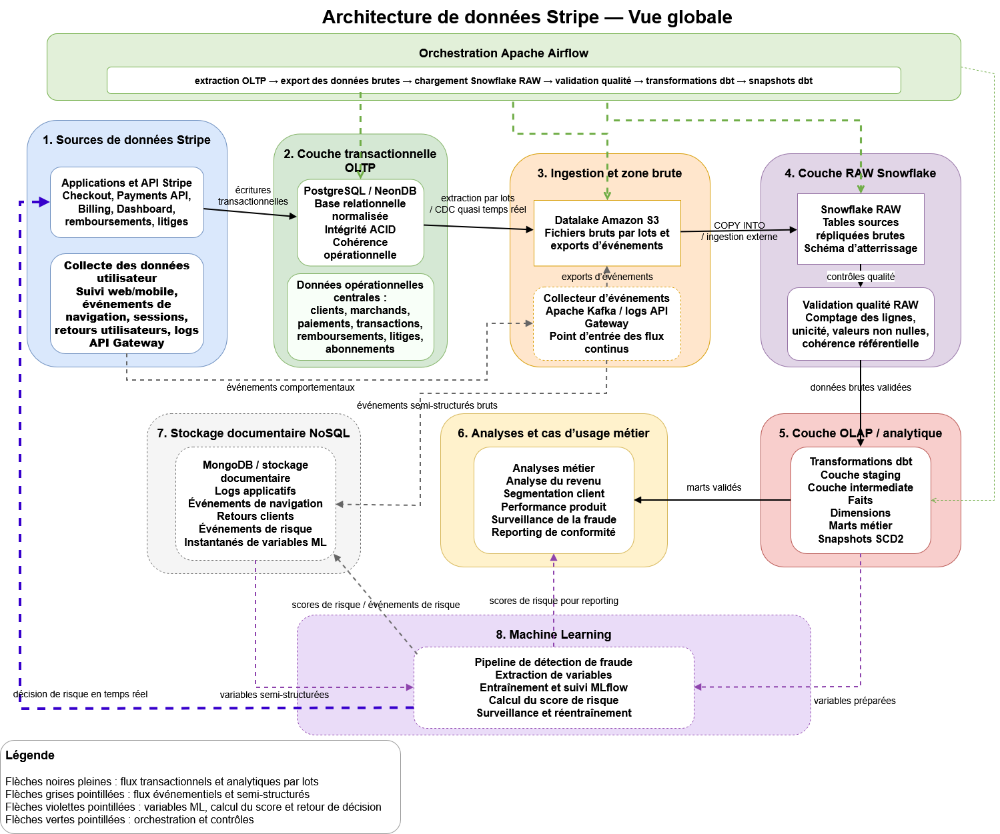
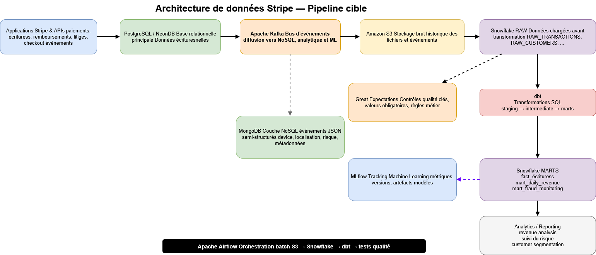
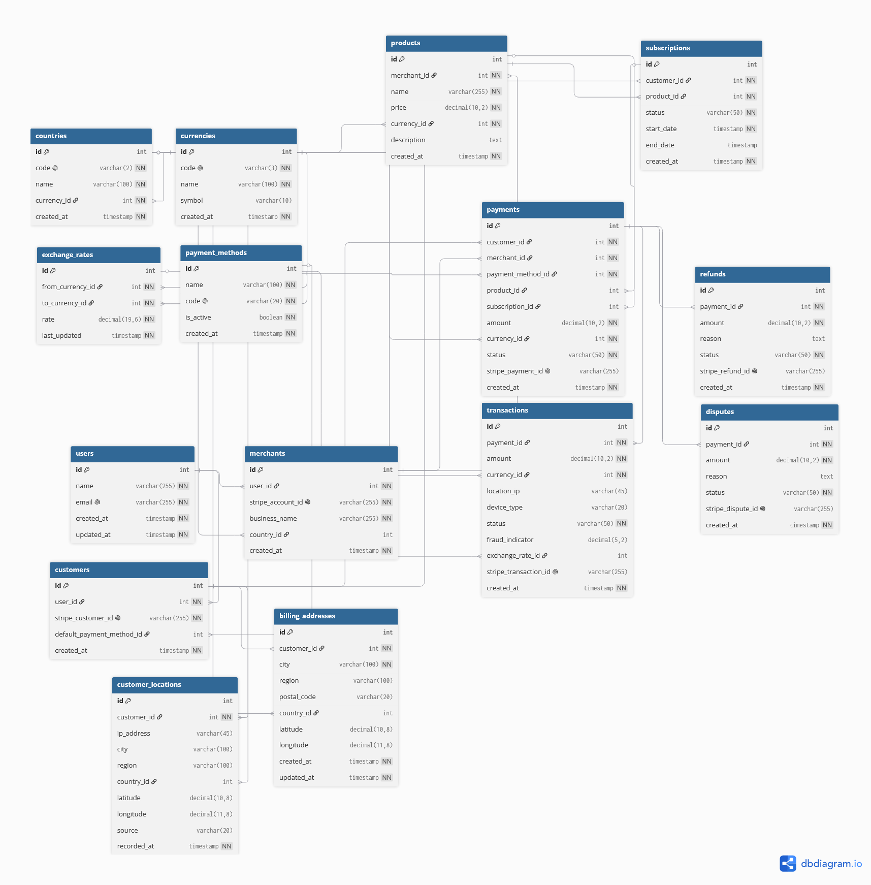
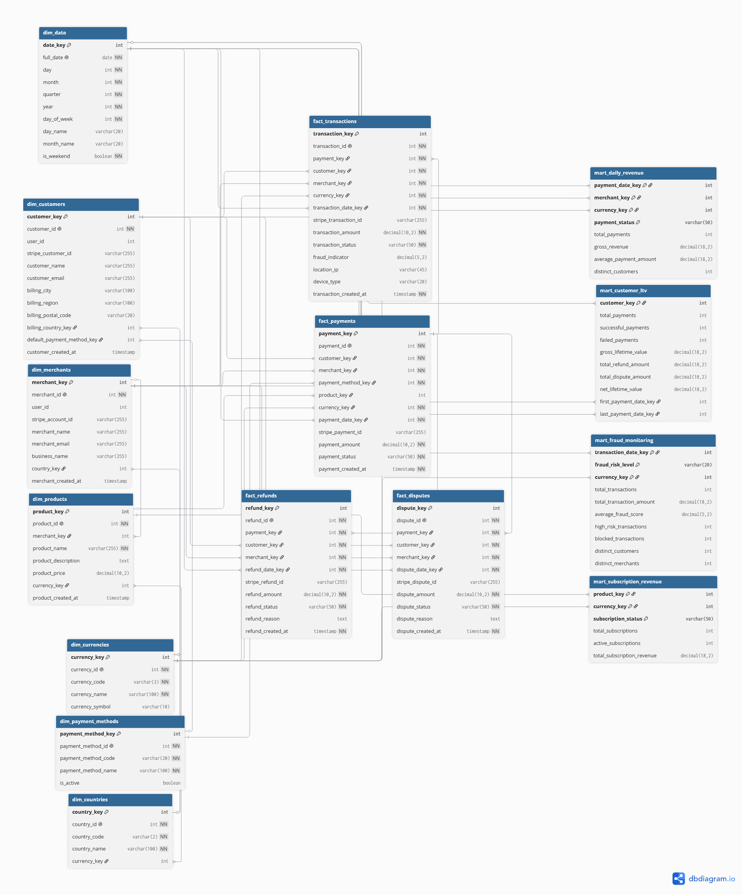
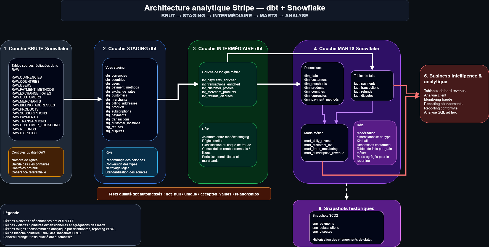
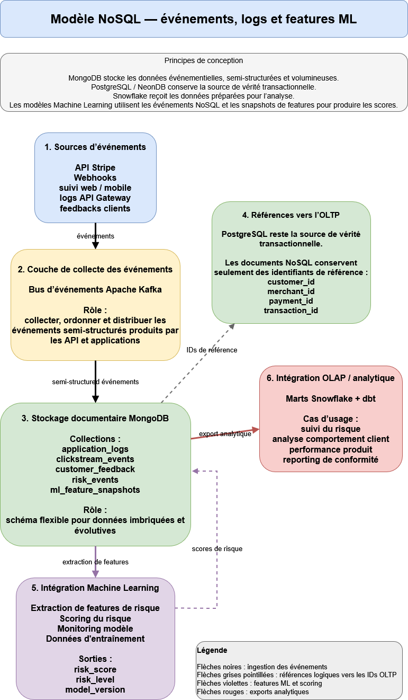
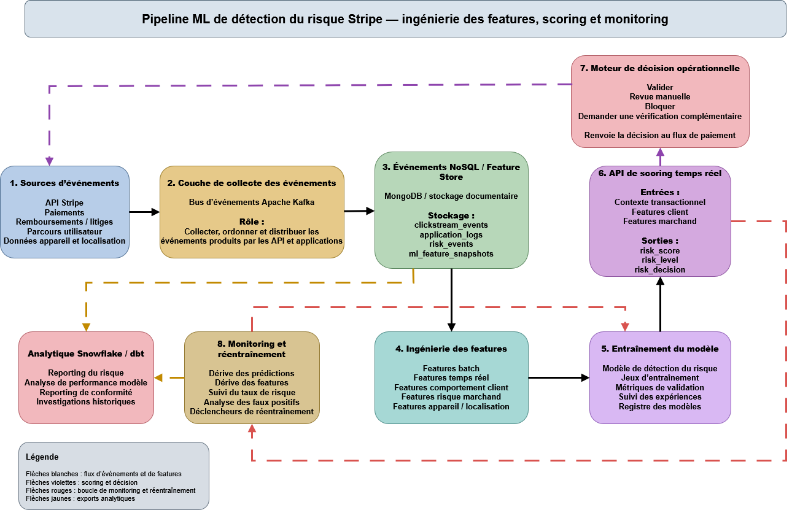

# Stripe Data Architecture Project

## 1. Objectif du projet

Ce projet propose une architecture de données complète pour une plateforme de paiement de type Stripe. L’objectif est de concevoir une organisation capable de gérer des données transactionnelles, analytiques et semi-structurées, tout en répondant aux besoins de reporting, de conformité, de monitoring et d’intégration Machine Learning.

L’architecture repose sur plusieurs composants complémentaires :

* **PostgreSQL / NeonDB** pour la gestion des données transactionnelles ;
* **Apache Kafka** pour la diffusion des événements ;
* **Amazon S3** pour le stockage brut et l’historisation des fichiers ;
* **Snowflake** pour l’entrepôt analytique ;
* **dbt** pour les transformations SQL ;
* **MongoDB** pour les données documentaires et semi-structurées ;
* **Great Expectations** pour les contrôles qualité ;
* **MLflow** pour le suivi des modèles Machine Learning ;
* **Apache Airflow** pour l’orchestration des pipelines.

Cette architecture distingue clairement les usages opérationnels, analytiques, événementiels et Machine Learning.

---

## 2. Livrables fournis

| Livrable attendu                        | Fichier correspondant                                            |
| --------------------------------------- | ---------------------------------------------------------------- |
| Comprehensive Data Architecture Diagram | `diagrams/01_global_architecture.png`                            |
| Data Pipeline Architecture              | `diagrams/02_pipeline_implementation.png`                        |
| ERD for OLTP System                     | `diagrams/03_oltp_erd.png` + `sql/creation_dbdiagram_Stripe.sql` |
| Schema Design for OLAP System           | `diagrams/04_olap_schema.png` + `diagrams/05_olap_dbt_flow.png`  |
| NoSQL Data Model                        | `diagrams/06_nosql_model.png`                                    |
| Machine Learning Integration Strategy   | `diagrams/07_ml_pipeline.png`                                    |
| SQL and NoSQL Queries                   | `queries/sql_queries.md` + `queries/nosql_queries.md`            |
| Support de présentation                 | `B2_Stripe.pptx`                                                 |
| Security and Compliance Plan            | Section 8 du README                                              |

---

## 3. Architecture globale et pipelines de données




L’architecture proposée repose sur une séparation claire des usages. PostgreSQL / NeonDB porte la partie transactionnelle et conserve les données structurées liées aux clients, marchands, parcours de paiement et opérations financières. Apache Kafka assure la diffusion des événements produits par les applications Stripe vers les autres composants, sans coupler directement les systèmes entre eux.

Snowflake constitue l’entrepôt analytique. Les données y sont transformées avec dbt afin de passer de données brutes à des modèles exploitables pour le reporting, l’analyse du revenu, le suivi des risques et la conformité. MongoDB complète l’architecture pour les données documentaires et semi-structurées, comme les logs applicatifs, les événements de parcours utilisateur, les signaux de risque et les snapshots de features Machine Learning.

Airflow orchestre les traitements planifiés, notamment les chargements, les contrôles qualité, les transformations dbt et les traitements de suivi. MLflow assure le suivi des modèles Machine Learning, de leurs métriques, de leurs versions et de leurs artefacts.



Le pipeline technique précise la circulation des données entre ces composants. Les opérations réalisées sur la plateforme sont enregistrées dans PostgreSQL / NeonDB, puis les événements associés sont diffusés via Kafka vers les systèmes consommateurs.

Les données destinées à l’analyse sont conservées dans Amazon S3 avant leur chargement dans Snowflake. Elles sont ensuite transformées avec dbt selon une logique progressive : `staging → intermediate → marts`. Les marts produits, comme `fact_transactions`, `mart_daily_revenue` ou `mart_fraud_monitoring`, servent aux analyses métier et aux tableaux de bord.

Great Expectations est utilisé pour contrôler la qualité des données avant leur exploitation. Les événements semi-structurés sont orientés vers MongoDB, tandis que les données utiles aux modèles alimentent les traitements Machine Learning.

---

## 4. Modèle OLTP — PostgreSQL / NeonDB



Le modèle OLTP est conçu pour gérer les opérations transactionnelles critiques de la plateforme. Il repose sur un schéma relationnel normalisé afin de garantir la cohérence des données, l’intégrité référentielle et la fiabilité des écritures.

PostgreSQL / NeonDB stocke les principales entités métier : utilisateurs, clients, marchands, paiements, transactions, remboursements, litiges, abonnements, produits, devises, pays, adresses de facturation, localisations clients et moyens de paiement.

Les relations entre tables sont construites avec des clés primaires et étrangères. Par exemple, un paiement est relié à un client, un marchand, une devise, un moyen de paiement, un produit ou un abonnement. Les remboursements et litiges sont rattachés aux paiements concernés.

Le schéma OLTP est conçu pour fonctionner avec les propriétés ACID d’un SGBD relationnel comme PostgreSQL / NeonDB.

L’**atomicité** est assurée au niveau des opérations métier critiques. Par exemple, la création d’un paiement et de sa transaction associée peut être exécutée dans une même transaction SQL : insertion dans `payments`, insertion dans `transactions`, puis validation par `COMMIT`. Si une étape échoue, un `ROLLBACK` annule l’ensemble de l’opération afin d’éviter qu’un paiement existe sans transaction associée, ou qu’une transaction soit enregistrée sans paiement valide.

La **cohérence** est renforcée directement par le modèle relationnel. Les clés étrangères imposent les dépendances métier : une transaction doit référencer un paiement existant, un remboursement ou un litige doit être rattaché à un paiement existant, un paiement doit référencer un client, un marchand, une devise et un moyen de paiement valides. Les contraintes `NOT NULL` empêchent l’absence de données indispensables, les contraintes `UNIQUE` évitent les doublons sur les identifiants externes Stripe, et les contraintes `CHECK` empêchent des valeurs invalides comme des montants négatifs ou un indicateur de fraude hors plage.

L’**isolation** est gérée par PostgreSQL lors des écritures concurrentes. Dans ce modèle, elle est importante pour éviter que deux traitements modifient simultanément des objets liés aux paiements, remboursements ou litiges. Les contraintes d’unicité sur les identifiants Stripe, comme `stripe_payment_id`, `stripe_transaction_id`, `stripe_refund_id` ou `stripe_dispute_id`, limitent aussi les risques d’insertion concurrente en double pour un même événement externe.

La **durabilité** repose sur les mécanismes du SGBD et de l’infrastructure NeonDB : une transaction validée est persistée par le moteur de base de données. Les données critiques sont également protégées par les mécanismes d’écriture journalisée, de sauvegarde et de réplication fournis par l’infrastructure. Cela garantit qu’un paiement, une transaction, un remboursement ou un litige validé reste disponible après validation, même en cas d’incident applicatif.

Le modèle contribue aussi à la robustesse en évitant certaines redondances. Par exemple, la table `transactions` référence `payments` via `payment_id` mais ne duplique pas `merchant_id`, car le marchand est déjà accessible par la relation `transactions → payments → merchants`. Cela limite les risques d’incohérence entre deux chemins relationnels différents.


Le fichier `sql/01_create_oltp_schema.sql` contient le script utilisé pour générer le schéma relationnel.

---

## 5. Modèle OLAP — Snowflake + dbt


Le fichier `sql/02_create_olap_schema.sql` contient le script SQL de création du modèle OLAP dimensionnel.



Le modèle OLAP est conçu pour répondre aux besoins de reporting, d’analyse financière, de suivi client, de monitoring du risque et de reporting de conformité.

Les données sont d’abord chargées dans la couche RAW de Snowflake. Cette couche conserve les données brutes issues des systèmes sources. dbt applique ensuite les transformations selon l’organisation suivante :

```text
RAW → STAGING → INTERMEDIATE → MARTS → ANALYTICS
```

La couche STAGING standardise les noms de colonnes, les types et les formats. La couche INTERMEDIATE applique les règles métier et prépare les enrichissements. La couche MARTS expose les tables de faits, les dimensions et les tables agrégées destinées aux utilisateurs métier.

Le modèle OLAP repose sur une logique dimensionnelle. Les tables de faits représentent les événements mesurables, comme les paiements, transactions, remboursements et litiges. Les dimensions fournissent les axes d’analyse : clients, marchands, produits, pays, devises et moyens de paiement.

Les principaux marts proposés sont :

* `mart_daily_revenue` pour le suivi du revenu quotidien ;
* `mart_customer_ltv` pour l’analyse de la valeur client ;
* `mart_fraud_monitoring` pour le suivi des transactions à risque ;
* `mart_subscription_revenue` pour l’analyse des revenus d’abonnement.

Les snapshots dbt, représentés dans le diagramme de flux dbt, permettent d’historiser les changements de statut sur des objets comme les paiements, abonnements et litiges. Cette logique SCD2 permet de reconstruire l’état historique des données à une date donnée.

Les performances peuvent être optimisées par la matérialisation des marts, l’utilisation de modèles dbt incrémentaux et le clustering Snowflake sur les grandes tables. Les analystes doivent interroger en priorité les marts validés plutôt que les tables brutes.

---

## 6. Modèle NoSQL — MongoDB



MongoDB est utilisé pour stocker les données semi-structurées, événementielles ou évolutives.

Les événements produits par les applications et API sont diffusés par Apache Kafka et peuvent être stockés dans MongoDB sous forme de documents JSON. Ce fonctionnement est adapté aux données dont la structure peut varier dans le temps, comme les logs, événements clickstream, feedbacks clients ou signaux de risque.

Les principales collections proposées sont :

* `application_logs` pour les logs applicatifs ;
* `clickstream_events` pour les événements de parcours utilisateur web ou mobile ;
* `customer_feedback` pour les retours clients ;
* `risk_events` pour les signaux de risque ;
* `ml_feature_snapshots` pour les features utilisées par les modèles Machine Learning.

MongoDB conserve des références vers les entités transactionnelles, par exemple `customer_id`, `merchant_id`, `payment_id` ou `transaction_id`. Cette stratégie permet de relier les événements NoSQL aux données OLTP sans dupliquer tout le modèle relationnel.

La couche NoSQL peut également alimenter Snowflake par des exports analytiques, ou être utilisée par les pipelines Machine Learning pour produire des features et des scores.

---

## 7. Stratégie d’intégration Machine Learning



Le cas d’usage Machine Learning retenu est la détection de risque de fraude. Il permet d’illustrer l’intégration entre les événements, les données transactionnelles, les features, le scoring et le monitoring.

Les événements liés aux paiements, aux transactions, aux appareils, à la localisation ou au comportement utilisateur peuvent être diffusés par Kafka. Ces données alimentent MongoDB, Snowflake ou les traitements Machine Learning selon leur usage.

La couche de feature engineering construit des variables à partir des données transactionnelles et événementielles. Ces features peuvent décrire le client, le marchand, le montant, le pays, l’appareil utilisé, la fréquence des transactions ou les signaux de comportement.

Le modèle de scoring produit un score de risque, un niveau de risque et une décision possible : validation, revue manuelle, blocage ou demande de vérification supplémentaire.

MLflow assure le suivi des modèles, des métriques, des artefacts et des versions. Il permet de comparer les performances des modèles et de conserver l’historique des expérimentations.

Le monitoring suit la dérive des features, la dérive des prédictions, la latence de scoring, les faux positifs, les faux négatifs et la performance par version de modèle. Ces informations peuvent déclencher un réentraînement lorsque les performances se dégradent ou lorsque de nouveaux labels deviennent disponibles.

---

## 8. Sécurité et conformité

L’architecture manipule des données sensibles liées aux paiements, aux clients, aux marchands, aux événements de risque et aux modèles Machine Learning. La sécurité doit donc être intégrée dès la conception, avec une approche par couches : contrôle des accès, chiffrement, cloisonnement des environnements, traçabilité, supervision et gouvernance des données.
- **Responsabilité principale** : équipes sécurité, conformité et data governance.

Afin de limiter les risques d’accès excessifs, les accès sont gérés selon le principe du moindre privilège, avec une logique RBAC centralisée. Les rôles sont séparés par domaine. Les équipes métier accèdent principalement aux marts validés dans Snowflake, tandis que les couches RAW, les données personnelles, les logs sensibles et les tables transactionnelles restent limitées aux rôles techniques autorisés.
- **Responsabilité principale** : équipes sécurité et data platform, avec validation des accès par les responsables métier.

Les données sont classifiées selon leur niveau de sensibilité. Les données critiques, notamment les données personnelles et les données liées aux paiements, sont tokenisées lorsqu’elles doivent circuler entre systèmes, puis masquées ou agrégées dans les couches analytiques. Les marts exposés aux utilisateurs métier évitent autant que possible les informations directement identifiantes.
- **Responsabilité principale** : équipes data governance et conformité.

Le chiffrement est appliqué en transit et au repos. Les communications entre services utilisent des protocoles sécurisés, notamment TLS. Les données stockées sont protégées par chiffrement au repos. La gestion des clés doit rester centralisée et contrôlée afin de limiter les accès non autorisés.
- **Responsabilité principale** : équipes sécurité.

La protection contre la perte de données repose sur la sauvegarde, la réplication et la capacité de reprise. PostgreSQL / NeonDB assure la persistance des données transactionnelles, S3 conserve les données brutes avec versioning et Snowflake permet l’historisation et la restauration des données analytiques. Les pipelines Airflow doivent être relançables afin d’éviter les duplications ou corruptions après un échec.
- **Responsabilité principale** : équipes data platform et équipes applicatives pour les données transactionnelles.

La conformité couvre principalement le RGPD et PCI-DSS. Les principes retenus sont :

* minimisation des données collectées et exposées ;
* limitation de la durée de conservation ;
* auditabilité des accès aux données sensibles ;
* traçabilité des traitements ;
* gestion des demandes d’effacement ;
* cloisonnement des données de paiement ;
* limitation de la diffusion des données critiques dans les couches analytiques ou événementielles.

- **Responsabilité principale** : équipes conformité, sécurité et data governance.

La supervision couvre les traitements critiques, les flux de données et les accès sensibles. Les échecs, anomalies de volume, changements de schéma ou accès inhabituels doivent déclencher des alertes. Les traitements sensibles, décisions de scoring et versions de modèles doivent rester auditables.
- **Responsabilité principale** : équipes data platform, MLOps et sécurité.


---

## 9. Requêtes SQL et NoSQL

Le fichier `queries/Queries.md` contient des exemples de requêtes permettant de répondre aux principales questions métier.

Les requêtes SQL sur Snowflake couvrent notamment :

* l’analyse du revenu ;
* le suivi des transactions ;
* la segmentation client ;
* le revenu glissant ;
* les indicateurs de risque.

Les requêtes NoSQL sur MongoDB couvrent notamment :

* l’analyse des événements ;
* le suivi des sessions ;
* les snapshots de features ML ;
* les logs d’audit ;
* les comportements utilisateurs.

Ces requêtes démontrent que les modèles proposés permettent de répondre à la fois aux besoins analytiques classiques et aux usages événementiels ou Machine Learning.

---

## 10. Conclusion

L’architecture proposée sépare clairement les responsabilités entre les différents systèmes.

PostgreSQL / NeonDB garantit la fiabilité des opérations transactionnelles. Apache Kafka diffuse les événements vers les systèmes consommateurs. Snowflake et dbt fournissent une couche analytique structurée pour les analyses métier. MongoDB apporte une couche flexible pour les événements, logs, feedbacks et features Machine Learning. Airflow orchestre les traitements batch. MLflow assure le suivi des modèles.

Cette architecture permet de couvrir les besoins principaux du projet : intégration OLTP, OLAP et NoSQL, modélisation des données, pipelines de synchronisation, sécurité, conformité, stratégie Machine Learning et exemples de requêtes métier.
